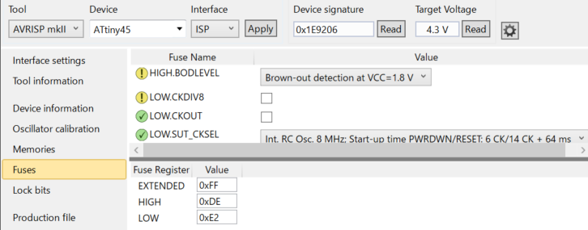

# Atmel ATtiny45 DCC Function Decoder Firmware

This project is DCC function decoder firmware in Atmel AVR microcontroller, operates with NMRA-conformance signals.

Works with Atmel AVR ATtiny45 / ATtiny85.
 (Not suitable for ATtiny25 because not enough program memory)

## Specs
  * Support Three Function Outputs
  * Function number F0-F28 can be assigned to each output, and conrtol by traveling direction
  * 16-step illumination control for each outputs
  * Support high-beam / low-beam operation for headlight function
  * headlights are always on operation regardless of the direction of travel for headlight/tail-light function
  * Compatible with Analog Powerpacks (includes PWM powerpack)

## Operation confirmed Digital Command Stations / Analog Controllers

### Digital Systems
  * Digitrax DCS50K (Kato D101)
  * Digitrax DCS100
  * Roco Z21

### Analog Systems
  * TOMIX N-1000CL
  * KATO PowerPack Standard S
  * KATO PowerPack Standard SX
  
## Compatible Circuits / PCB
  * T-8919D
  * T-0507D
  
If you want to build your own circuit and operate it, refer to the circuit diagram included in the PCB design data.

## Other Documents

  * [CV List](docs/CVList_en.md)

## AVR Fuse Bit config

  * EXTENDED: 0xFF
  * HIGH: 0xDE
  * LOW: 0xE2

